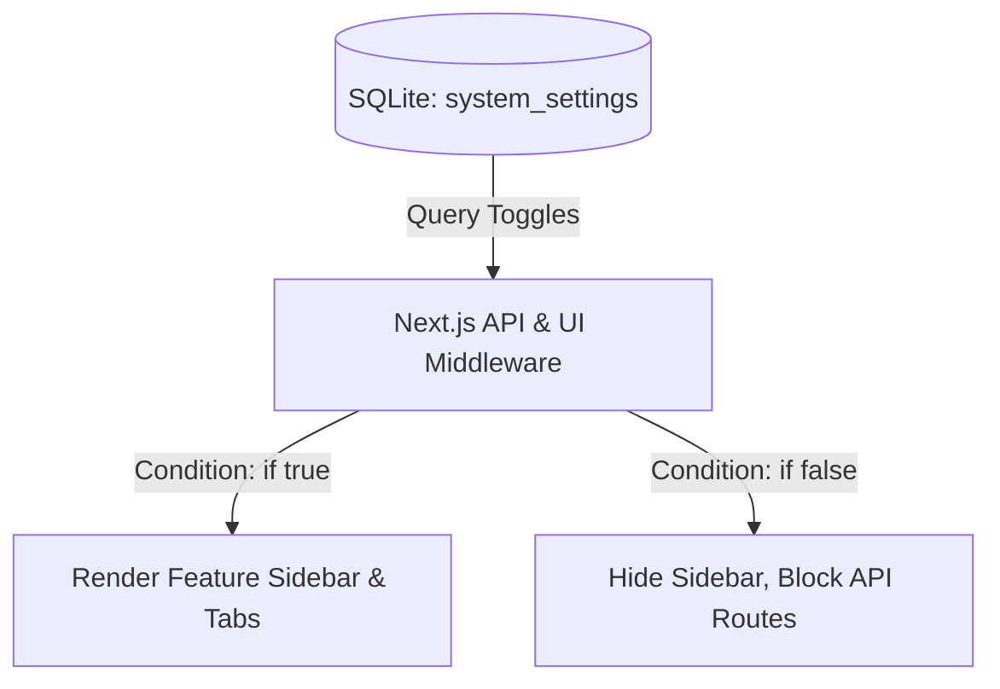

# Feature Switches & Modular Toggles Design

This document details the architecture for enabling and disabling specific application features dynamically (similar to ERPNext modules) to keep the user interface clean and prevent user overwhelm.

---

## 🎯 Modular Architecture

Mahiru Finance OS contains many features (Bank Reconciliation, Partnership Ledger, Crypto Tax, Bot Integration, Live Stock Tickers). To prevent individual/family users from being overwhelmed by features they do not need, we implement a **Feature Switch** control panel in Settings.



---

## 💾 Database Schema

```sql
-- Track state of each module
CREATE TABLE IF NOT EXISTS module_switches (
  id INTEGER PRIMARY KEY AUTOINCREMENT,
  module_key TEXT NOT NULL UNIQUE, -- e.g., 'crypto_tax', 'partnership', 'bot', 'bank_reconcile'
  label TEXT NOT NULL,
  description TEXT,
  is_enabled INTEGER DEFAULT 1, -- 1 = Enabled, 0 = Disabled
  category TEXT DEFAULT 'general'
);

-- Seed default values
INSERT OR IGNORE INTO module_switches (module_key, label, description, is_enabled) VALUES
('bank_reconciliation', 'Bank statement tally', 'Upload bank statements (CSV/Excel) and reconcile ledger differences.', 1),
('partnership_ledger', 'Partnership ledger', 'Track capital contributions and drawings between multiple business partners.', 0),
('crypto_tax', 'Crypto tax tracking', 'Enable 30% flat tax calculations on virtual digital asset transactions.', 0),
('investments_live', 'Live investment tickers', 'Enable daily updates of gold and stock values from external APIs.', 1),
('telegram_bot', 'Telegram bot integration', 'Allows logging transactions via Telegram messaging.', 1);
```

---

## ⚙️ Middleware & Conditional Rendering Logic

### 1. Database Check Utility
```javascript
// lib/moduleChecker.js
import db from './db';

export async function isModuleEnabled(moduleKey) {
  const switchRecord = await db.queryOne(
    "SELECT is_enabled FROM module_switches WHERE module_key = ?", 
    [moduleKey]
  );
  return switchRecord ? switchRecord.is_enabled === 1 : false;
}
```

### 2. Frontend Sidebar / Navigation Component
```javascript
// components/Sidebar.jsx
'use client';
import Link from 'next/link';

export default function Sidebar({ enabledModules }) {
  return (
    <nav className="sidebar">
      <Link href="/dashboard">Dashboard</Link>
      <Link href="/accounts">Accounts</Link>
      
      {enabledModules.bank_reconciliation && (
        <Link href="/reconciliation">Tally Statements</Link>
      )}

      {enabledModules.partnership_ledger && (
        <Link href="/partners">Partnership Ledger</Link>
      )}

      {enabledModules.crypto_tax && (
        <Link href="/tax/crypto">Crypto Taxes</Link>
      )}
    </nav>
  );
}
```

### 3. API Route Guard
```javascript
// app/api/partners/route.js
import { NextResponse } from 'next/server';
import { isModuleEnabled } from '@/lib/moduleChecker';

export async function GET() {
  const enabled = await isModuleEnabled('partnership_ledger');
  if (!enabled) {
    return NextResponse.json({ error: "Module disabled" }, { status: 403 });
  }

  // Fetch partnership data...
}
```
