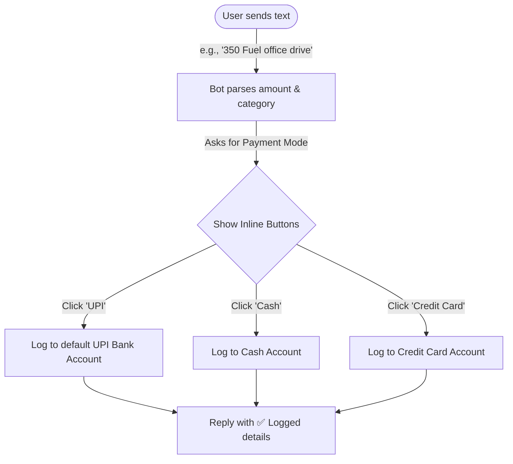

# UI Design: Chat Bot Button Flows

This document maps out the interactive user flows and inline keyboard layouts for logging transactions via Telegram.

---

## 🤖 Interaction Flowchart



---

## 🔘 Inline Keyboard UI layouts

When the bot needs user choices, it sends structured inline buttons to avoid typing:

### Layout 1: Payment Mode Selection
Sent after parsing the text transaction.
```
┌──────────────────────────────────────┐
│ Select payment mode:                 │
├───────────────────┬──────────────────┤
│ 📱 UPI            │ 💵 Cash          │
├───────────────────┼──────────────────┤
│ 💳 Credit Card    │ 🏦 Bank Transfer │
└───────────────────┴──────────────────┘
```

### Layout 2: Tax Classification Selection
Sent for large transactions (e.g. above ₹10,000) or if the category matches business expenses:
```
┌──────────────────────────────────────┐
│ Classify under which Tax Head?       │
├───────────────────┬──────────────────┤
│ 🏠 Personal       │ 💼 Business (ITC)│
├───────────────────┴──────────────────┤
│ 📜 Exempt Income                     │
└──────────────────────────────────────┘
```

### Layout 3: Missing Category Resolver
If the regex cannot determine the category, it prompts the user to select one:
```
┌──────────────────────────────────────┐
│ What was this expense for?           │
├─────────────┬─────────────┬──────────┤
│ 🍔 Food     │ 🚗 Fuel     │ 🛍️ Shop  │
├─────────────┼─────────────┼──────────┤
│ 🔌 Bills    │ 🏥 Medical  │ ✈️ Travel │
└─────────────┴─────────────┴──────────┘
```
